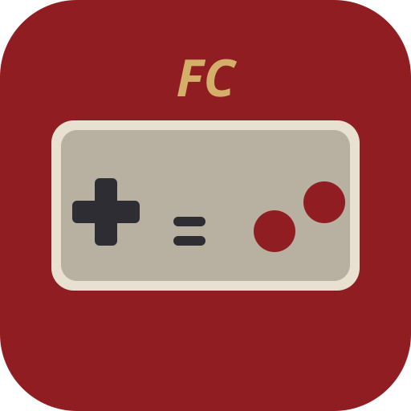

# FC Pocket — ファミコン (NES) エミュレータ モバイルアプリ

ブラウザだけで動く、タッチ操作対応のファミコンエミュレータ PWA です。
フレームワーク・ビルドツール不使用の純粋な JavaScript (ES Modules) で、
CPU・PPU・APU・マッパーをすべてスクラッチ実装しています。



## 特徴

- 📱 **モバイルファースト UI** — 十字キー / A・B / SELECT・START のタッチコントローラ (マルチタッチ・スライド操作対応、バイブレーションフィードバック付き)
- 🎮 **入力 3 系統** — タッチ / キーボード (←↑↓→, Z=B, X=A, Enter=START, Shift=SELECT) / Gamepad API
- 🔊 **サウンド対応** — パルス×2・三角波・ノイズ・DMC の 5ch APU を Web Audio で再生
- 💾 **セーブ機能** — バッテリーバックアップ (SRAM) の自動保存 + ステートセーブ/ロード (localStorage)
- 📴 **PWA** — ホーム画面に追加すればオフラインでフルスクリーン動作 (Service Worker)
- ▶ **内蔵デモ ROM** — ROM ファイルがなくても動作確認できるハンドアセンブル済みデモ入り
- 🔒 ROM ファイルは端末内でのみ処理され、外部送信されません

## 使い方

静的ファイルのみなので、任意の HTTP サーバーで配信するだけです。

```sh
npm start          # http-server で http://localhost:8080 を起動
```

スマホで開いて「ホーム画面に追加」すると、フルスクリーンのアプリとして動作します。
「📂 ROM」からお手持ちの合法的に入手した `.nes` ファイル (自作ゲーム・自己吸出しなど) を読み込むか、「▶ デモ」で内蔵デモを起動してください。

## エミュレーション実装

| コンポーネント | 内容 |
| --- | --- |
| CPU (`js/cpu.js`) | 6502 (RP2A03)。公式全命令 + 主要非公式命令 (LAX/SAX/DCP/ISB/SLO/RLA/SRE/RRA 等)、ページ跨ぎサイクル、NMI/IRQ |
| PPU (`js/ppu.js`) | 2C02 をドット単位 (341×262) でエミュレート。loopy の内部レジスタ v/t/x/w によるスクロール、背景シフトレジスタ、スプライト 0 ヒット、8 スプライト制限、奇数フレームのドットスキップ |
| APU (`js/apu.js`) | パルス×2 (エンベロープ/スイープ)、三角波 (線形カウンタ)、ノイズ (LFSR)、DMC (DMA 読み出し)、4/5 ステップフレームカウンタ、NESdev Wiki 準拠のルックアップテーブル式ミキサー |
| マッパー (`js/mappers.js`) | 0 (NROM) / 1 (MMC1) / 2 (UxROM) / 3 (CNROM) / 4 (MMC3, スキャンライン IRQ) / 7 (AxROM) |
| 本体 (`js/nes.js`) | iNES パーサ、CPU メモリマップ、OAM DMA (513 サイクルストール)、標準コントローラ、セーブステート |
| デモ (`js/demo.js`) | ミニアセンブラ内蔵。スクロール + スプライト + パレットを使う NROM デモをその場で生成 |

## テスト

```sh
npm test   # Node.js 上で内蔵デモを 150 フレーム実行し、映像・NMI・APU・ステート保存を検証
```

## 参考資料

実装にあたり以下の資料を参照しました。

- [NESdev Wiki — PPU registers](https://www.nesdev.org/wiki/PPU_registers) / [PPU scrolling](https://www.nesdev.org/wiki/PPU_scrolling) (v/t/x/w 内部レジスタの挙動)
- [NESdev Wiki — APU](https://www.nesdev.org/wiki/APU) / [APU Mixer](https://www.nesdev.org/wiki/APU_Mixer) (フレームカウンタとミキサー式)
- [NESdev Wiki — PPU programmer reference](https://www.nesdev.org/wiki/PPU_programmer_reference)
- NES研究所・[ギコ猫でもわかるファミコンプログラミング](https://www.ma.ccnw.ne.jp/okunyon/prog.html)系の日本語ファミコン開発解説 (デモ ROM の初期化シーケンス: VBlank 2 回待ち → パレット → ネームテーブル → 描画有効化)

## 免責事項

本ソフトウェアは技術研究・自作ゲーム実行を目的としたエミュレータです。
市販ゲームの ROM イメージの無断複製・配布は著作権法違反です。
ご自身が権利を持つ ROM のみお使いください。

## ライセンス

MIT
